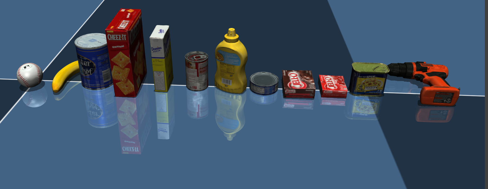

# YCB_sim
MuJoCo models for YCB objects (https://www.ycbbenchmarks.com/)

# Instructions
- Download YCB objects from http://ycb-benchmarks.s3-website-us-east-1.amazonaws.com/. For example, the `055_baseball` is under `YCB_models` folder.
- Create `assets_obj_name.xml` and `body_obj_name.xml`, and specify the file path of its mesh and texture.
- Add it into `ycb_objects.xml` and run `python -m mujoco.viewer --mjcf=ycb_objects.xml` for visualization.

# Notes
 - [MuJoCo 2.3.5](https://github.com/deepmind/mujoco) is highly recommended. The old version might have issues to load `*.obj` meshes or visualize the texture.
 - The collision behavior in MuJoCo is wrong for concave objects. Since MuJoCo only detects collisions with the convex hulls of concave objects, 
a convex decomposition of the concave mesh is required, for example, using a script from [obj2mjcf](https://github.com/kevinzakka/obj2mjcf), 
which is based on [V-HACD](https://github.com/kmammou/v-hacd) for the decomposition.
